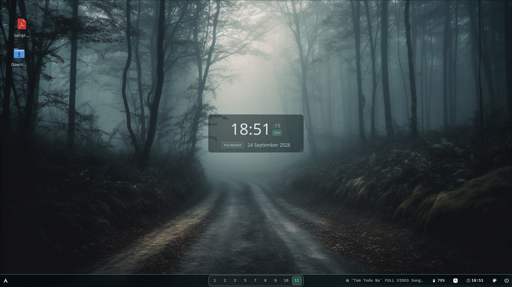
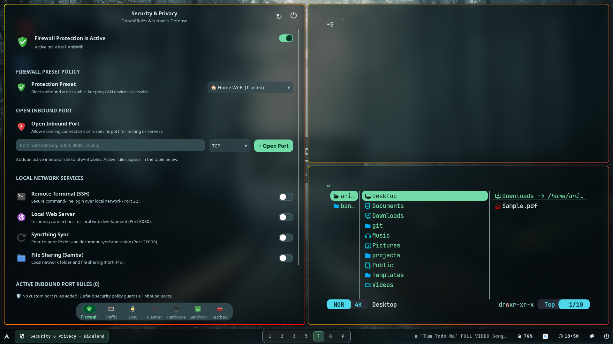
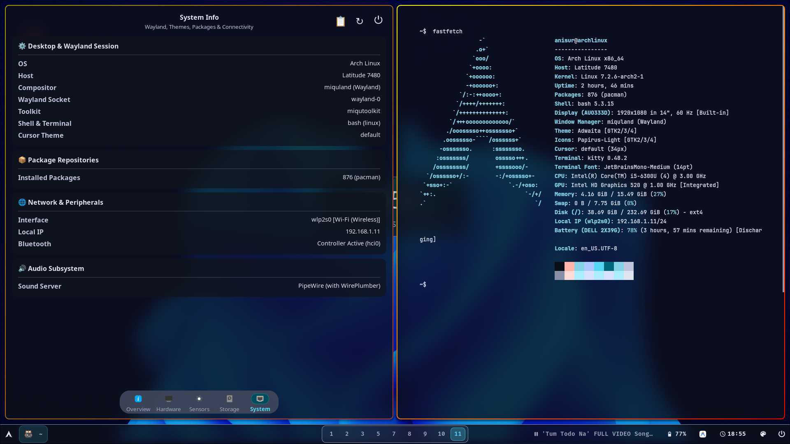
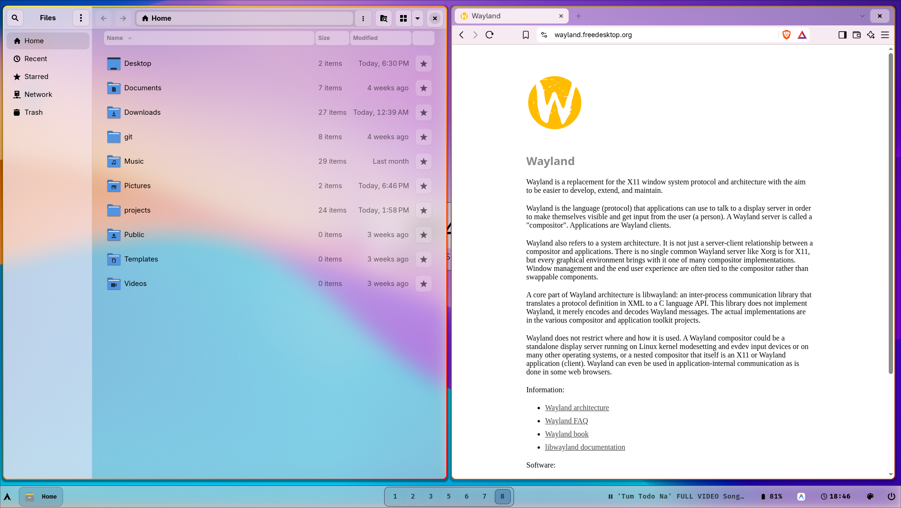
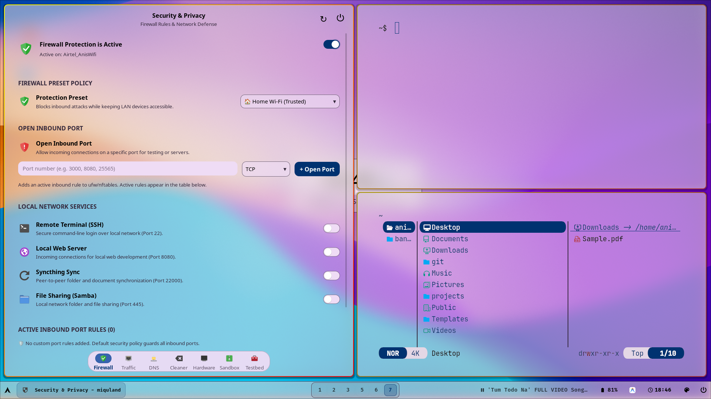

# Miquland

Miquland is a dynamic tiling Wayland compositor built with wlroots and SceneFX, designed as the core compositor of the Miqu desktop ecosystem alongside a native suite of applications built with the custom-designed `miqutoolkit`.

- **Modular Applications**: Applications are built on `miqutoolkit` and can run independently across any Wayland compositor.
- **Deeply Configurable**: For full functionality, keybindings, animations, window rules, and layer shell styling, see [`assets/miquland.conf`](assets/miquland.conf).

---

## Screenshots

